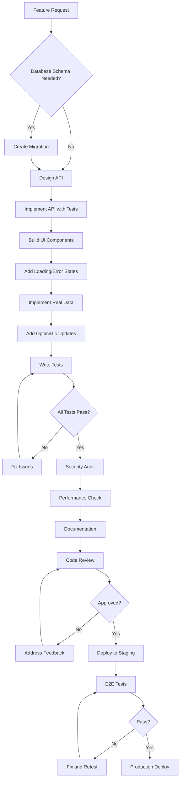

Based on the comprehensive documentation provided, here's a strict rulebook for implementing the AI Cost Guardian platform to ensure production readiness:

# 🔒 AI Cost Guardian - Production Implementation Rulebook

## 📋 MANDATORY COMPLIANCE CHECKLIST

### 1. ARCHITECTURE ENFORCEMENT

```typescript
// STRICT FOLDER STRUCTURE - NO DEVIATIONS
/app/                    // Next.js 14 App Router ONLY
  /(public)/            // Unauthenticated routes
  /(protected)/         // Auth-required routes  
  /api/                 // API routes with proper error handling
/components/            
  /ui/                  // shadcn/ui components ONLY
  /shared/              // Reusable components
/lib/                   // Core business logic
  /*-client.ts          // Provider clients with encryption
/hooks/                 // Custom React hooks
/types/                 // TypeScript definitions
/prisma/                // Database schema
```

**VIOLATIONS:**
- ❌ NO pages directory (App Router only)
- ❌ NO component libraries except shadcn/ui
- ❌ NO business logic in components
- ❌ NO untyped JavaScript files

### 2. GLOBAL SETUP REQUIREMENTS

```typescript
// REQUIRED BEFORE ANY FEATURE DEVELOPMENT
export const globalSetupChecklist = {
  database: {
    provider: 'PostgreSQL + Prisma',
    migrations: 'Run before ANY feature work',
    seeding: 'Required for dev environment'
  },
  authentication: {
    provider: 'NextAuth.js',
    session: 'JWT with secure cookies',
    middleware: 'Protected route enforcement'
  },
  encryption: {
    algorithm: 'AES-256-GCM',
    keyStorage: 'Environment variable',
    implementation: 'Before ANY API key storage'
  },
  monitoring: {
    errors: 'Sentry integration required',
    analytics: 'Posthog/Vercel Analytics',
    performance: 'Web Vitals tracking'
  }
};
```

### 3. FRONTEND ARCHITECTURE RULES

```typescript
// COMPONENT STANDARDS
interface ComponentRules {
  // Every component MUST:
  loading: 'Implement Suspense boundaries';
  error: 'Have error boundaries';
  responsive: 'Mobile-first with all breakpoints';
  accessible: 'WCAG 2.1 AA compliant';
  typed: 'Full TypeScript, no any';
  memoized: 'Use React.memo for expensive renders';
}

// DATA FETCHING PATTERN
const dataFetchingRules = {
  client: 'React Query with proper caching',
  server: 'Server Components with streaming',
  realtime: 'WebSockets with reconnection logic',
  validation: 'Zod schemas for ALL inputs'
};

// STATE MANAGEMENT
const stateRules = {
  global: 'Context API with proper providers',
  server: 'React Query or SWR',
  form: 'React Hook Form with Zod',
  url: 'useSearchParams for filters'
};
```

### 4. PERFORMANCE MANDATES

```typescript
// PERFORMANCE BUDGETS - STRICTLY ENFORCED
const performanceBudgets = {
  metrics: {
    FCP: 1.8,  // First Contentful Paint < 1.8s
    LCP: 2.5,  // Largest Contentful Paint < 2.5s
    CLS: 0.1,  // Cumulative Layout Shift < 0.1
    FID: 100,  // First Input Delay < 100ms
    TTFB: 600  // Time to First Byte < 600ms
  },
  
  bundles: {
    initial: '500KB max',
    chunks: '200KB max per route',
    images: 'Next/Image with optimization'
  },
  
  api: {
    response: '< 500ms',
    database: '< 100ms per query',
    cache: 'Redis for repeated queries'
  }
};

// OPTIMIZATION REQUIREMENTS
const optimizationRules = {
  images: 'WebP with fallbacks',
  fonts: 'Variable fonts with font-display: swap',
  code: 'Dynamic imports for heavy components',
  css: 'CSS Modules or Tailwind only',
  scripts: 'Defer non-critical JavaScript'
};
```

### 5. UI RENDERING STANDARDS

```tsx
// UI COMPONENT TEMPLATE
const UIComponentTemplate = () => {
  // REQUIRED: Loading state
  if (isLoading) {
    return <Skeleton className="h-full w-full" />;
  }
  
  // REQUIRED: Error state
  if (error) {
    return (
      <Alert variant="destructive">
        <AlertDescription>{error.message}</AlertDescription>
      </Alert>
    );
  }
  
  // REQUIRED: Empty state
  if (!data || data.length === 0) {
    return (
      <EmptyState 
        title="No data found"
        description="Get started by adding your first item"
        action={<Button>Add Item</Button>}
      />
    );
  }
  
  // REQUIRED: Success state with proper keys
  return (
    <div className="space-y-4">
      {data.map((item) => (
        <Card key={item.id}> {/* Always use stable keys */}
          {/* Component content */}
        </Card>
      ))}
    </div>
  );
};

// ANIMATION RULES
const animationRules = {
  pageTransitions: 'Framer Motion with layout animations',
  microInteractions: 'CSS transitions for hover/focus',
  loading: 'Skeleton screens, not spinners',
  modals: 'Radix Dialog with proper focus management'
};
```

### 6. UX REQUIREMENTS

```typescript
// USER FEEDBACK PATTERNS
const feedbackPatterns = {
  actions: {
    immediate: 'Optimistic updates for all mutations',
    loading: 'Button loading states with disabled',
    success: 'Toast notifications with undo',
    error: 'Inline errors with recovery actions'
  },
  
  forms: {
    validation: 'Real-time with debouncing',
    errors: 'Field-level with clear messages',
    submission: 'Disable form during submit',
    success: 'Clear form or redirect'
  },
  
  navigation: {
    breadcrumbs: 'Show current location',
    progress: 'NavigationProgress bar',
    guards: 'Confirm before destructive actions',
    persistence: 'Save draft states'
  }
};

// ACCESSIBILITY REQUIREMENTS
const a11yRequirements = {
  keyboard: 'Full keyboard navigation',
  screenReaders: 'Proper ARIA labels',
  contrast: 'WCAG AA minimum',
  focus: 'Visible focus indicators',
  errors: 'Announced to screen readers'
};
```

### 7. API IMPLEMENTATION RULES

```typescript
// API ROUTE TEMPLATE
export async function POST(request: Request) {
  try {
    // 1. Authentication check
    const session = await getServerSession(authOptions);
    if (!session) {
      return NextResponse.json(
        { error: 'Unauthorized' },
        { status: 401 }
      );
    }
    
    // 2. Input validation with Zod
    const body = await request.json();
    const validated = schema.parse(body);
    
    // 3. Rate limiting check
    const rateLimitOk = await checkRateLimit(session.user.id);
    if (!rateLimitOk) {
      return NextResponse.json(
        { error: 'Rate limit exceeded' },
        { status: 429 }
      );
    }
    
    // 4. Business logic with error handling
    const result = await performAction(validated);
    
    // 5. Audit logging
    await logActivity({
      userId: session.user.id,
      action: 'API_CALL',
      details: { endpoint: request.url }
    });
    
    // 6. Consistent response format
    return NextResponse.json({
      success: true,
      data: result,
      timestamp: new Date().toISOString()
    });
    
  } catch (error) {
    // 7. Error tracking
    await captureException(error);
    
    // 8. Safe error response
    return NextResponse.json(
      { 
        error: 'Internal server error',
        code: 'INTERNAL_ERROR'
      },
      { status: 500 }
    );
  }
}
```

### 8. DATABASE OPERATIONS

```typescript
// DATABASE QUERY PATTERNS
const databaseRules = {
  // ALWAYS use transactions for multiple operations
  transactions: async () => {
    return await prisma.$transaction(async (tx) => {
      // Multiple operations
    });
  },
  
  // ALWAYS include error handling
  errorHandling: async () => {
    try {
      return await prisma.user.findUnique({
        where: { id },
        include: { 
          apiKeys: true // Selective includes
        }
      });
    } catch (error) {
      if (error instanceof Prisma.PrismaClientKnownRequestError) {
        // Handle specific errors
      }
      throw error;
    }
  },
  
  // ALWAYS optimize queries
  optimization: {
    pagination: 'Use cursor-based for large sets',
    selection: 'Only select needed fields',
    indexing: 'Add indexes for frequent queries',
    caching: 'Cache expensive computations'
  }
};
```

### 9. TESTING REQUIREMENTS

```typescript
// TEST COVERAGE MANDATES
const testingRules = {
  unit: {
    coverage: '80% minimum',
    patterns: 'AAA pattern (Arrange, Act, Assert)',
    mocking: 'Mock external dependencies only'
  },
  
  integration: {
    api: 'Test all endpoints with MSW',
    database: 'Use test database with seeds',
    auth: 'Test all permission scenarios'
  },
  
  e2e: {
    journeys: 'Critical paths with Playwright',
    browsers: 'Chrome, Firefox, Safari',
    devices: 'Desktop and mobile viewports'
  },
  
  performance: {
    load: 'K6 for 1000+ concurrent users',
    stress: 'Identify breaking points',
    soak: '24-hour stability tests'
  }
};

// TESTING CHECKLIST FOR EACH FEATURE
const featureTestChecklist = [
  'Unit tests for business logic',
  'Integration tests for API',
  'Component tests with React Testing Library',
  'Accessibility tests with axe-core',
  'Visual regression with Percy',
  'Performance tests with Lighthouse',
  'Security scan with OWASP ZAP'
];
```

### 10. PRODUCTION READINESS GATES

```typescript
// NO FEATURE IS COMPLETE WITHOUT:
const productionGates = {
  code: {
    review: 'Two approvals required',
    coverage: 'Tests passing with >80% coverage',
    linting: 'Zero ESLint errors',
    types: 'Zero TypeScript errors'
  },
  
  security: {
    scan: 'Pass security audit',
    dependencies: 'No critical vulnerabilities',
    secrets: 'All keys in environment variables',
    encryption: 'Sensitive data encrypted'
  },
  
  performance: {
    lighthouse: 'Score > 90',
    bundleSize: 'Within budget',
    loadTime: '< 3 seconds',
    apiResponse: '< 500ms'
  },
  
  documentation: {
    api: 'OpenAPI spec updated',
    readme: 'Setup instructions current',
    changelog: 'Version notes added',
    storybook: 'Components documented'
  }
};
```

### 11. DEPLOYMENT CHECKLIST

```bash
# PRE-DEPLOYMENT VERIFICATION
- [ ] All environment variables set
- [ ] Database migrations run
- [ ] Redis cache cleared
- [ ] CDN cache purged
- [ ] SSL certificates valid
- [ ] Monitoring alerts configured
- [ ] Backup strategy tested
- [ ] Rollback plan documented
- [ ] Load testing passed
- [ ] Security scan completed
- [ ] Accessibility audit passed
- [ ] Documentation updated
```

### 12. FORBIDDEN PRACTICES

```typescript
// ABSOLUTELY PROHIBITED:
const forbidden = {
  data: [
    '❌ NO mock data in production code',
    '❌ NO console.log statements',
    '❌ NO commented code',
    '❌ NO TODO comments in main branch'
  ],
  
  security: [
    '❌ NO hardcoded secrets',
    '❌ NO unencrypted API keys',
    '❌ NO SQL string concatenation',
    '❌ NO eval() or Function() constructors'
  ],
  
  performance: [
    '❌ NO synchronous operations in API routes',
    '❌ NO unbounded queries',
    '❌ NO client-side sensitive operations',
    '❌ NO unoptimized images'
  ],
  
  code: [
    '❌ NO any types',
    '❌ NO var declarations',
    '❌ NO direct DOM manipulation',
    '❌ NO global variables'
  ]
};
```

### 13. IMPLEMENTATION WORKFLOW



## 🚨 ENFORCEMENT PROTOCOL

1. **Pre-commit Hooks**: Husky + lint-staged for automatic checks
2. **CI/CD Pipeline**: Block merge if any rule violated
3. **Code Reviews**: Mandatory checklist completion
4. **Monitoring**: Automated alerts for performance degradation
5. **Audits**: Weekly security and accessibility scans

## 📝 DEVIATION PROCESS

If deviation from these rules is necessary:
1. Document the reason in detail
2. Get written approval from tech lead
3. Create ticket for future correction
4. Add temporary exception with expiration date
5. Monitor impact with additional testing

---

**Remember**: These rules ensure production readiness. No exceptions without documented justification and remediation plan.